# 关系数据库模式说明

## 1. 依据的 ER 模型要点

根据 ER 图修改版，包含以下实体与关系：

- 实体：Customer, Company, Loan_Application, Asset, Loan_Approval, Loan_Payment, Appraisal
- 关系：works_at, applies_for, approval, generates, pledges, valuation
- 特殊语义：
  - `{phone_number}` 为 Customer 的多值属性
  - `approval_round`、`installment_num`、`appraisal_date` 为弱实体部分键（在图中为虚线下划线）
  - `pledge_ratio` 为关系 pledges 的属性

## 2. E-R 到关系模型的转换规则（本次采用）

1. 强实体转换为基本关系表，主键沿用实体主键。
2. 1:N 关系通过在 N 端加入外键实现。
3. N:N 关系转换为独立中间表，主键一般为两端外键的组合，并保留关系属性。
4. 多值属性拆分为独立关系表，通常使用“拥有者主键 + 属性值”作为复合主键。
5. 弱实体转换为独立表，主键采用“拥有者主键 + 部分键”，并设置外键指向拥有者。

## 3. 对应关系表设计

### 3.1 Company

- `company_id` (PK)
- `company_name`
- `industry`
- `enterprise_level`

### 3.2 Customer

- `customer_id` (PK)
- `company_id` (FK -> Company.company_id)  
  说明：由 works_at (Customer N : 1 Company) 转换得到
- `name`
- `id_card` (建议 UNIQUE)
- `credit_rating`
- `pet_type`
- `pet_amount`
- `pet_expense`

### 3.3 Customer_Phone

- `customer_id` (PK, FK -> Customer.customer_id)
- `phone_number` (PK)

说明：由 Customer 的多值属性 `{phone_number}` 拆分得到。

### 3.4 Loan_Application

- `application_id` (PK)
- `customer_id` (FK -> Customer.customer_id)  
  说明：由 applies_for (Customer 1 : N Loan_Application) 转换得到
- `amount`
- `duration`

### 3.5 Asset

- `asset_id` (PK)
- `asset_type`

### 3.6 Pledge

- `application_id` (PK, FK -> Loan_Application.application_id)
- `asset_id` (PK, FK -> Asset.asset_id)
- `pledge_ratio`

说明：由 pledges (Loan_Application N : N Asset) 及其关系属性 `pledge_ratio` 转换得到。

### 3.7 Loan_Approval

- `application_id` (PK, FK -> Loan_Application.application_id)
- `approval_round` (PK)
- `approver`
- `approved_amount`
- `result`

说明：由弱实体 Loan_Approval（部分键 approval_round）和识别关系 approval 转换得到。

### 3.8 Loan_Payment

- `application_id` (PK, FK -> Loan_Application.application_id)
- `installment_num` (PK)
- `due_date`
- `principal_paid`
- `interest_paid`
- `status`

说明：由弱实体 Loan_Payment（部分键 installment_num）和识别关系 generates 转换得到。

### 3.9 Appraisal

- `asset_id` (PK, FK -> Asset.asset_id)
- `appraisal_date` (PK)
- `estimated_value`
- `appraiser`

说明：由弱实体 Appraisal（部分键 appraisal_date）和识别关系 valuation 转换得到。

## 4. 关系数据库模式（形式化表示）

- Company(`company_id`, company_name, industry, enterprise_level)
- Customer(`customer_id`, company_id, name, id_card, credit_rating, pet_type, pet_amount, pet_expense)
- Customer_Phone(`customer_id`, `phone_number`)
- Loan_Application(`application_id`, customer_id, amount, duration)
- Asset(`asset_id`, asset_type)
- Pledge(`application_id`, `asset_id`, pledge_ratio)
- Loan_Approval(`application_id`, `approval_round`, approver, approved_amount, result)
- Loan_Payment(`application_id`, `installment_num`, due_date, principal_paid, interest_paid, status)
- Appraisal(`asset_id`, `appraisal_date`, estimated_value, appraiser)

其中带下划线字段（此处用反引号显示）表示主键；复合主键用多个字段共同表示。

## 5. 主外键约束汇总

- Customer.company_id -> Company.company_id
- Customer_Phone.customer_id -> Customer.customer_id
- Loan_Application.customer_id -> Customer.customer_id
- Pledge.application_id -> Loan_Application.application_id
- Pledge.asset_id -> Asset.asset_id
- Loan_Approval.application_id -> Loan_Application.application_id
- Loan_Payment.application_id -> Loan_Application.application_id
- Appraisal.asset_id -> Asset.asset_id

## 6. 建议补充的数据完整性约束

- Customer.id_card 设置 UNIQUE
- Pledge.pledge_ratio 设置 CHECK (pledge_ratio >= 0 AND pledge_ratio <= 1)
- 所有主键字段设置 NOT NULL
- 所有外键字段设置 NOT NULL（若业务允许可空则按业务调整）

## 7. 使用 SQL 创建数据库模式（MySQL）

### 7.1 执行步骤

1. 打开 MySQL Workbench，新建 SQL Editor。
2. 先执行 `CREATE DATABASE` 与 `USE`，创建并切换到项目数据库。
3. 按“先父表、后子表”的顺序执行 DDL（Company/Customer/Loan_Application/Asset 等）。
4. 执行完成后使用 `SHOW TABLES;` 检查是否创建成功。

### 7.2 完整 DDL（可直接运行）

```sql
-- =====================================================
-- bankCreditDB 数据库创建脚本
-- =====================================================

DROP DATABASE IF EXISTS bankCreditDB;
CREATE DATABASE bankCreditDB
  CHARACTER SET utf8mb4
  COLLATE utf8mb4_0900_ai_ci;
USE bankCreditDB;

-- 1) 强实体：Company
CREATE TABLE Company (
  company_id        BIGINT       NOT NULL,
  company_name      VARCHAR(120) NOT NULL,
  industry          VARCHAR(80)  NOT NULL,
  enterprise_level  VARCHAR(40)  NOT NULL,
  CONSTRAINT pk_company PRIMARY KEY (company_id)
) ENGINE=InnoDB;

-- 2) 强实体：Customer（含 works_at 外键）
CREATE TABLE Customer (
  customer_id       BIGINT        NOT NULL,
  company_id        BIGINT        NOT NULL,
  name              VARCHAR(80)   NOT NULL,
  id_card           VARCHAR(40)   NOT NULL,
  credit_rating     DECIMAL(5,2)  NOT NULL,
  pet_type          VARCHAR(40)   NULL,
  pet_amount        INT           NULL,
  pet_expense       DECIMAL(12,2) NULL,
  CONSTRAINT pk_customer PRIMARY KEY (customer_id),
  CONSTRAINT uq_customer_id_card UNIQUE (id_card),
  CONSTRAINT fk_customer_company
    FOREIGN KEY (company_id) REFERENCES Company(company_id)
    ON UPDATE CASCADE
    ON DELETE RESTRICT,
  CONSTRAINT ck_customer_pet_amount CHECK (pet_amount IS NULL OR pet_amount >= 0),
  CONSTRAINT ck_customer_pet_expense CHECK (pet_expense IS NULL OR pet_expense >= 0),
  CONSTRAINT ck_customer_credit_rating CHECK (credit_rating >= 0)
) ENGINE=InnoDB;

-- 3) 多值属性拆分：Customer_Phone
CREATE TABLE Customer_Phone (
  customer_id       BIGINT       NOT NULL,
  phone_number      VARCHAR(30)  NOT NULL,
  CONSTRAINT pk_customer_phone PRIMARY KEY (customer_id, phone_number),
  CONSTRAINT fk_customer_phone_customer
    FOREIGN KEY (customer_id) REFERENCES Customer(customer_id)
    ON UPDATE CASCADE
    ON DELETE CASCADE
) ENGINE=InnoDB;

-- 4) 强实体：Loan_Application（含 applies_for 外键）
CREATE TABLE Loan_Application (
  application_id    BIGINT        NOT NULL,
  customer_id       BIGINT        NOT NULL,
  amount            DECIMAL(14,2) NOT NULL,
  duration          INT           NOT NULL,
  CONSTRAINT pk_loan_application PRIMARY KEY (application_id),
  CONSTRAINT fk_loan_application_customer
    FOREIGN KEY (customer_id) REFERENCES Customer(customer_id)
    ON UPDATE CASCADE
    ON DELETE RESTRICT,
  CONSTRAINT ck_loan_application_amount CHECK (amount > 0),
  CONSTRAINT ck_loan_application_duration CHECK (duration > 0)
) ENGINE=InnoDB;

-- 5) 强实体：Asset
CREATE TABLE Asset (
  asset_id          BIGINT       NOT NULL,
  asset_type        VARCHAR(60)  NOT NULL,
  CONSTRAINT pk_asset PRIMARY KEY (asset_id)
) ENGINE=InnoDB;

-- 6) N:N 关系：Pledge（pledges + 关系属性 pledge_ratio）
CREATE TABLE Pledge (
  application_id    BIGINT        NOT NULL,
  asset_id          BIGINT        NOT NULL,
  pledge_ratio      DECIMAL(6,4)  NOT NULL,
  CONSTRAINT pk_pledge PRIMARY KEY (application_id, asset_id),
  CONSTRAINT fk_pledge_application
    FOREIGN KEY (application_id) REFERENCES Loan_Application(application_id)
    ON UPDATE CASCADE
    ON DELETE RESTRICT,
  CONSTRAINT fk_pledge_asset
    FOREIGN KEY (asset_id) REFERENCES Asset(asset_id)
    ON UPDATE CASCADE
    ON DELETE RESTRICT,
  CONSTRAINT ck_pledge_ratio CHECK (pledge_ratio >= 0 AND pledge_ratio <= 1)
) ENGINE=InnoDB;

-- 7) 弱实体：Loan_Approval（识别关系 approval）
CREATE TABLE Loan_Approval (
  application_id    BIGINT        NOT NULL,
  approval_round    INT           NOT NULL,
  approver          VARCHAR(80)   NOT NULL,
  approved_amount   DECIMAL(14,2) NOT NULL,
  result            VARCHAR(20)   NOT NULL,
  CONSTRAINT pk_loan_approval PRIMARY KEY (application_id, approval_round),
  CONSTRAINT fk_loan_approval_application
    FOREIGN KEY (application_id) REFERENCES Loan_Application(application_id)
    ON UPDATE CASCADE
    ON DELETE CASCADE,
  CONSTRAINT ck_loan_approval_round CHECK (approval_round > 0),
  CONSTRAINT ck_loan_approval_amount CHECK (approved_amount >= 0),
  CONSTRAINT ck_loan_approval_result CHECK (result IN ('approved', 'rejected', 'pending'))
) ENGINE=InnoDB;

-- 8) 弱实体：Loan_Payment（识别关系 generates）
CREATE TABLE Loan_Payment (
  application_id    BIGINT        NOT NULL,
  installment_num   INT           NOT NULL,
  due_date          DATE          NOT NULL,
  principal_paid    DECIMAL(14,2) NOT NULL,
  interest_paid     DECIMAL(14,2) NOT NULL,
  status            VARCHAR(20)   NOT NULL,
  CONSTRAINT pk_loan_payment PRIMARY KEY (application_id, installment_num),
  CONSTRAINT fk_loan_payment_application
    FOREIGN KEY (application_id) REFERENCES Loan_Application(application_id)
    ON UPDATE CASCADE
    ON DELETE CASCADE,
  CONSTRAINT ck_loan_payment_installment CHECK (installment_num > 0),
  CONSTRAINT ck_loan_payment_principal CHECK (principal_paid >= 0),
  CONSTRAINT ck_loan_payment_interest CHECK (interest_paid >= 0),
  CONSTRAINT ck_loan_payment_status CHECK (status IN ('due', 'paid', 'overdue'))
) ENGINE=InnoDB;

-- 9) 弱实体：Appraisal（识别关系 valuation）
CREATE TABLE Appraisal (
  asset_id          BIGINT        NOT NULL,
  appraisal_date    DATE          NOT NULL,
  estimated_value   DECIMAL(14,2) NOT NULL,
  appraiser         VARCHAR(80)   NOT NULL,
  CONSTRAINT pk_appraisal PRIMARY KEY (asset_id, appraisal_date),
  CONSTRAINT fk_appraisal_asset
    FOREIGN KEY (asset_id) REFERENCES Asset(asset_id)
    ON UPDATE CASCADE
    ON DELETE CASCADE,
  CONSTRAINT ck_appraisal_value CHECK (estimated_value >= 0)
) ENGINE=InnoDB;

-- 验证：查看已创建表
SHOW TABLES;
```
效果展示：
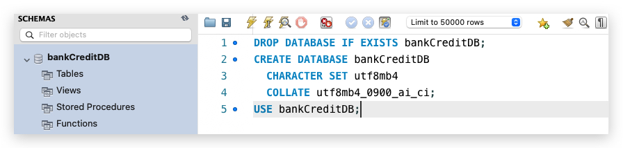
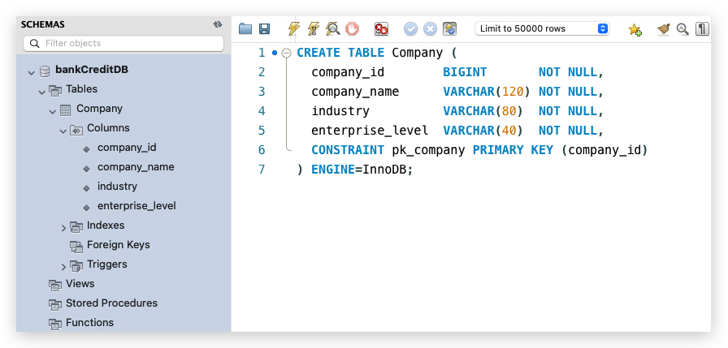
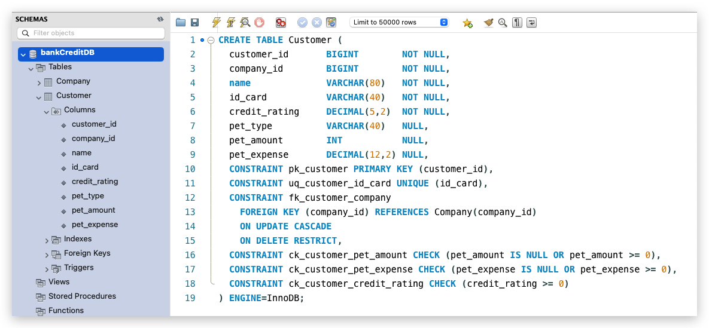
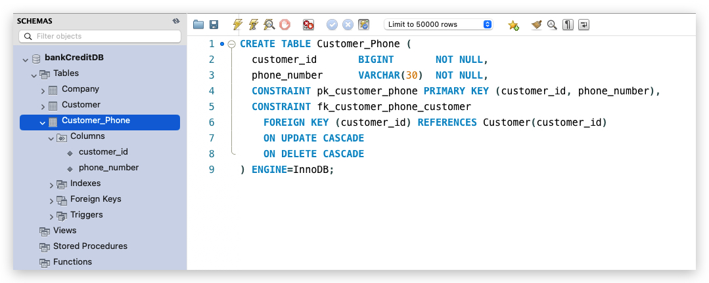
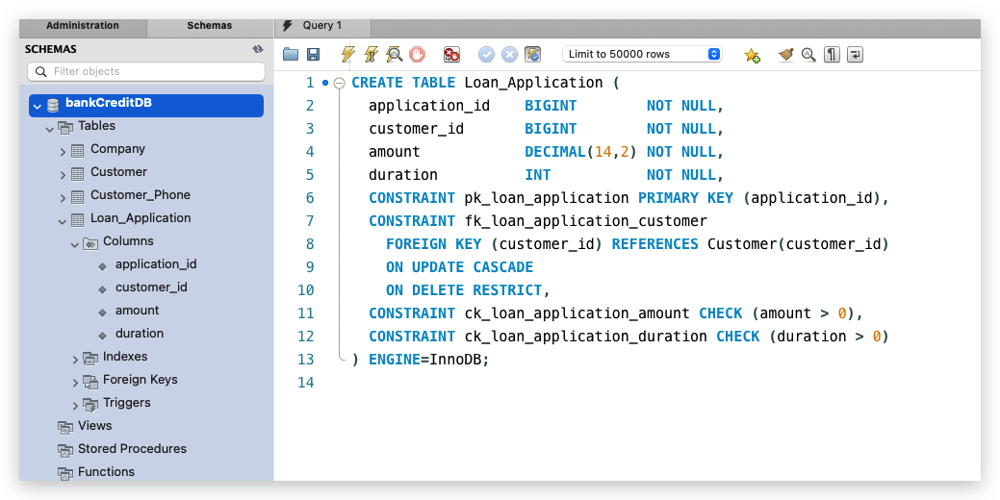
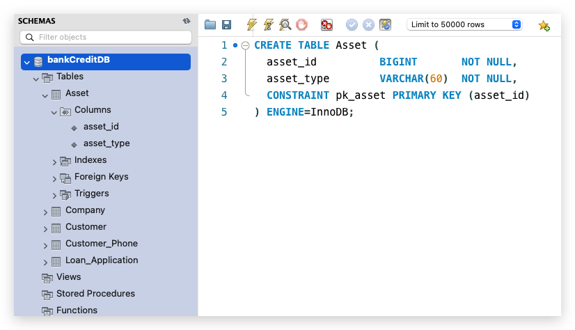
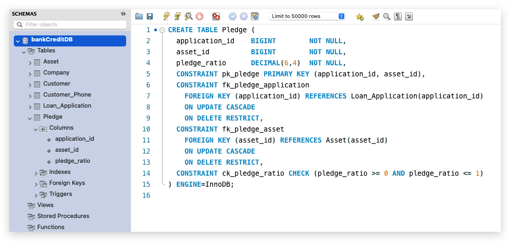
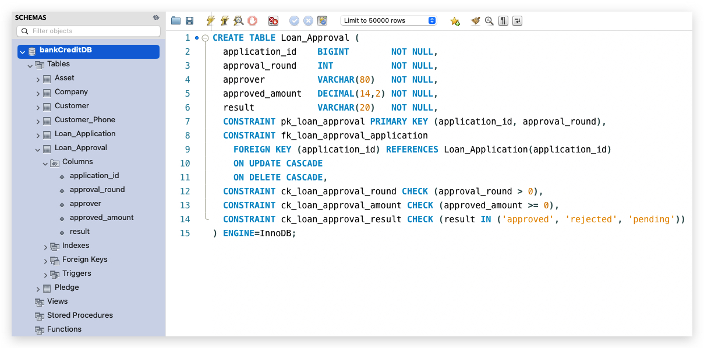
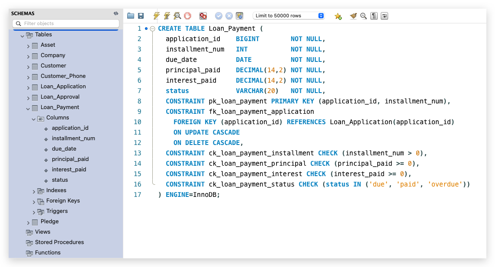
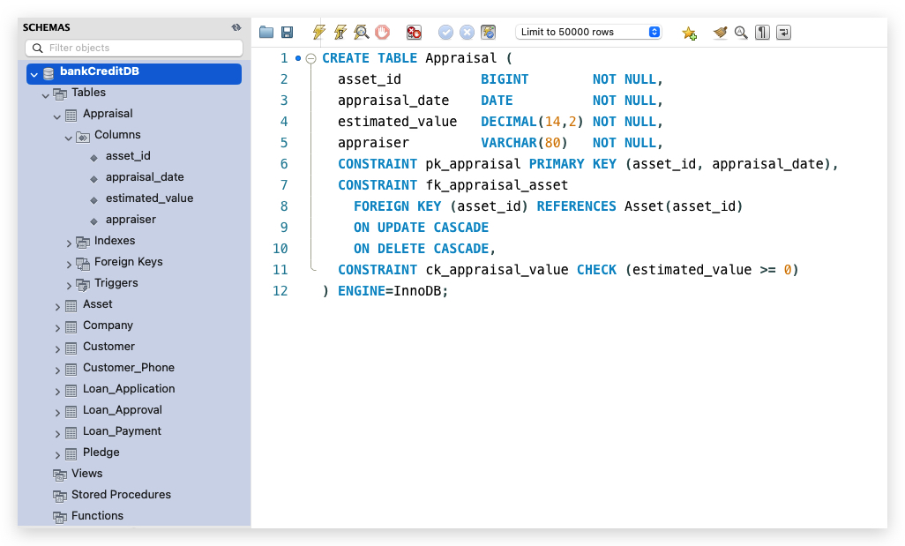


### 7.3 与 ER 转换结果的对应说明

1. `Customer.company_id` 对应关系 `works_at`。
2. `Loan_Application.customer_id` 对应关系 `applies_for`。
3. `Pledge(application_id, asset_id, pledge_ratio)` 对应关系 `pledges` 及其关系属性。
4. `Loan_Approval`、`Loan_Payment`、`Appraisal` 的复合主键体现了弱实体“拥有者主键 + 部分键”的转换。
5. `Customer_Phone` 对应多值属性 `{phone_number}` 的拆分。

## 8. 结论

以上关系表已经完成从 ER 模型到关系数据库模式的转换，覆盖了：

- 强实体
- 1:N 关系
- N:N 关系（含关系属性）
- 多值属性
- 弱实体与识别关系

可作为课程作业中的“E-R 转关系模型”提交版本。

## 9. DML：向每个表插入至少 10 条记录

说明：以下数据与前述 DDL 约束一致，可在已建库后直接执行。

```sql
USE bankCreditDB;

-- 1) Company (10 rows)
INSERT INTO Company (company_id, company_name, industry, enterprise_level) VALUES
(101, 'Harbor Logistics Ltd', 'Logistics', 'A'),
(102, 'Bluewave Trading Co', 'Trading', 'B'),
(103, 'Nova Tech Services', 'Technology', 'A'),
(104, 'Greenfield Foods', 'Food', 'B'),
(105, 'Sunrise Retail Group', 'Retail', 'C'),
(106, 'Pearl River Manufacturing', 'Manufacturing', 'A'),
(107, 'Eastern Healthcare Supplies', 'Healthcare', 'B'),
(108, 'Skyline Construction Co', 'Construction', 'A'),
(109, 'Silverline Education Services', 'Education', 'B'),
(110, 'Westlake AgriTech', 'Agriculture', 'C');

-- 2) Customer (10 rows)
INSERT INTO Customer (customer_id, company_id, name, id_card, credit_rating, pet_type, pet_amount, pet_expense) VALUES
(1001, 101, 'Chen Wei',  'ID1001A', 88.50, 'Dog',    1, 1200.00),
(1002, 102, 'Li Na',     'ID1002B', 79.00, 'Cat',    2,  900.00),
(1003, 103, 'Zhang Lei', 'ID1003C', 91.20, NULL,   NULL,    NULL),
(1004, 104, 'Wang Yu',   'ID1004D', 73.60, 'Parrot', 1,  300.00),
(1005, 105, 'Liu Min',   'ID1005E', 85.00, 'Dog',    2, 1500.00),
(1006, 106, 'Xu Bin',    'ID1006F', 82.40, NULL,   NULL,    NULL),
(1007, 107, 'Gao Yuan',  'ID1007G', 90.10, 'Cat',    1,  650.00),
(1008, 108, 'Sun Jie',   'ID1008H', 77.30, 'Dog',    1, 1100.00),
(1009, 109, 'He Ning',   'ID1009I', 86.70, 'Fish',   6,  220.00),
(1010, 110, 'Deng Qian', 'ID1010J', 80.90, NULL,   NULL,    NULL);

-- 3) Customer_Phone (>=10 rows)
INSERT INTO Customer_Phone (customer_id, phone_number) VALUES
(1001, '13800000001'),
(1001, '13800000011'),
(1002, '13800000002'),
(1003, '13800000003'),
(1004, '13800000004'),
(1005, '13800000005'),
(1005, '13800000015'),
(1006, '13800000006'),
(1007, '13800000007'),
(1008, '13800000008'),
(1009, '13800000009'),
(1010, '13800000010');

-- 4) Loan_Application (10 rows)
INSERT INTO Loan_Application (application_id, customer_id, amount, duration) VALUES
(2001, 1001, 300000.00, 24),
(2002, 1002, 180000.00, 18),
(2003, 1003, 500000.00, 36),
(2004, 1004, 120000.00, 12),
(2005, 1005, 260000.00, 24),
(2006, 1006, 420000.00, 30),
(2007, 1007, 150000.00, 15),
(2008, 1008, 330000.00, 24),
(2009, 1009, 210000.00, 20),
(2010, 1010, 390000.00, 36);

-- 5) Asset (10 rows)
INSERT INTO Asset (asset_id, asset_type) VALUES
(3001, 'Apartment'),
(3002, 'Vehicle'),
(3003, 'Warehouse'),
(3004, 'Equipment'),
(3005, 'Shop'),
(3006, 'Office Building'),
(3007, 'Farmland'),
(3008, 'Factory'),
(3009, 'Truck Fleet'),
(3010, 'Clinic Property');

-- 6) Pledge (10 rows)
INSERT INTO Pledge (application_id, asset_id, pledge_ratio) VALUES
(2001, 3001, 0.70),
(2002, 3002, 0.65),
(2003, 3003, 0.80),
(2004, 3004, 0.55),
(2005, 3005, 0.60),
(2006, 3006, 0.75),
(2007, 3007, 0.50),
(2008, 3008, 0.72),
(2009, 3009, 0.58),
(2010, 3010, 0.67);

-- 7) Loan_Approval (>=10 rows)
INSERT INTO Loan_Approval (application_id, approval_round, approver, approved_amount, result) VALUES
(2001, 1, 'Manager_A', 280000.00, 'approved'),
(2002, 1, 'Manager_B',      0.00, 'rejected'),
(2003, 1, 'Manager_A', 450000.00, 'pending'),
(2003, 2, 'Director_C',480000.00, 'approved'),
(2004, 1, 'Manager_D', 100000.00, 'approved'),
(2005, 1, 'Manager_B', 220000.00, 'approved'),
(2006, 1, 'Manager_E', 380000.00, 'approved'),
(2007, 1, 'Manager_A', 130000.00, 'approved'),
(2008, 1, 'Manager_C', 300000.00, 'pending'),
(2009, 1, 'Manager_D', 180000.00, 'approved'),
(2010, 1, 'Director_B',350000.00, 'approved');

-- 8) Loan_Payment (>=10 rows)
INSERT INTO Loan_Payment (application_id, installment_num, due_date, principal_paid, interest_paid, status) VALUES
(2001, 1, '2026-01-15', 10000.00, 1200.00, 'paid'),
(2001, 2, '2026-02-15', 10000.00, 1150.00, 'paid'),
(2002, 1, '2026-01-20',     0.00,    0.00, 'due'),
(2003, 1, '2026-01-10', 12000.00, 1800.00, 'paid'),
(2003, 2, '2026-02-10', 12000.00, 1750.00, 'overdue'),
(2004, 1, '2026-01-25',  8000.00,  900.00, 'paid'),
(2005, 1, '2026-01-18',  9000.00, 1100.00, 'paid'),
(2006, 1, '2026-01-12', 14000.00, 1900.00, 'paid'),
(2007, 1, '2026-01-28',  7000.00,  800.00, 'paid'),
(2008, 1, '2026-01-30', 11000.00, 1300.00, 'due'),
(2009, 1, '2026-01-22',  8500.00,  950.00, 'paid'),
(2010, 1, '2026-01-26', 13000.00, 1700.00, 'overdue');

-- 9) Appraisal (10 rows)
INSERT INTO Appraisal (asset_id, appraisal_date, estimated_value, appraiser) VALUES
(3001, '2025-12-20', 450000.00, 'Eva Chan'),
(3002, '2025-12-21', 120000.00, 'Leo Wu'),
(3003, '2025-12-22', 700000.00, 'Mia Lin'),
(3004, '2025-12-23', 160000.00, 'John Ho'),
(3005, '2025-12-24', 320000.00, 'Amy Tang'),
(3006, '2025-12-25', 620000.00, 'Ryan Gu'),
(3007, '2025-12-26', 210000.00, 'Nina Xie'),
(3008, '2025-12-27', 760000.00, 'Owen Feng'),
(3009, '2025-12-28', 280000.00, 'Ivy Luo'),
(3010, '2025-12-29', 540000.00, 'Kenny Lam');
```

可选校验：

```sql
SELECT 'Company' AS table_name, COUNT(*) AS row_count FROM Company
UNION ALL SELECT 'Customer', COUNT(*) FROM Customer
UNION ALL SELECT 'Customer_Phone', COUNT(*) FROM Customer_Phone
UNION ALL SELECT 'Loan_Application', COUNT(*) FROM Loan_Application
UNION ALL SELECT 'Asset', COUNT(*) FROM Asset
UNION ALL SELECT 'Pledge', COUNT(*) FROM Pledge
UNION ALL SELECT 'Loan_Approval', COUNT(*) FROM Loan_Approval
UNION ALL SELECT 'Loan_Payment', COUNT(*) FROM Loan_Payment
UNION ALL SELECT 'Appraisal', COUNT(*) FROM Appraisal;
```

## 10. 查询示例（至少 5 个）

说明：以下每个查询都包含“自然语言描述 + SQL + 结果示例（基于上面的插入数据）”。

### 查询 1：列出所有贷款申请及其客户姓名与申请金额

```sql
SELECT la.application_id, c.name AS customer_name, la.amount, la.duration
FROM Loan_Application la
JOIN Customer c ON la.customer_id = c.customer_id
ORDER BY la.application_id;
```

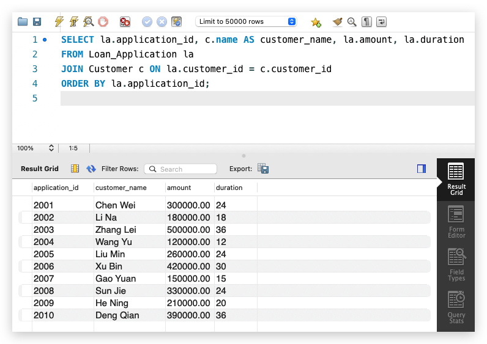

### 查询 2：查询每位客户对应公司的信息（works_at 关系验证）

```sql
SELECT c.customer_id, c.name AS customer_name, co.company_name, co.industry
FROM Customer c
JOIN Company co ON c.company_id = co.company_id
ORDER BY c.customer_id;
```

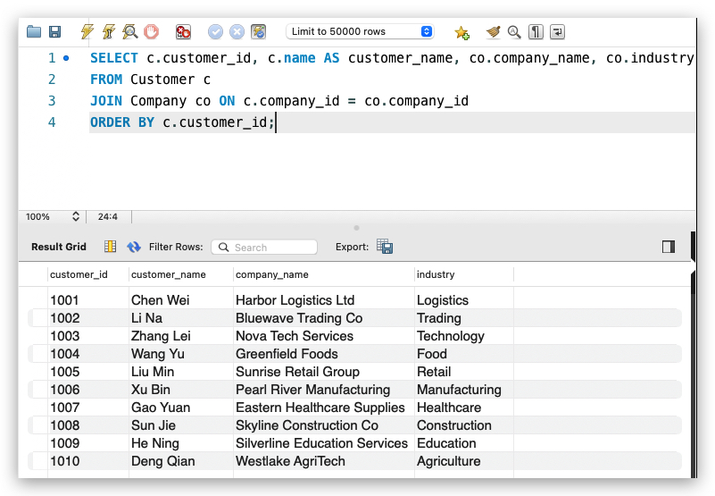

### 查询 3：统计每个申请的抵押物估值与质押比例

```sql
SELECT p.application_id, p.asset_id, a.asset_type, ap.estimated_value, p.pledge_ratio,
       ROUND(ap.estimated_value * p.pledge_ratio, 2) AS secured_value
FROM Pledge p
JOIN Asset a ON p.asset_id = a.asset_id
JOIN Appraisal ap ON ap.asset_id = p.asset_id
ORDER BY p.application_id;
```

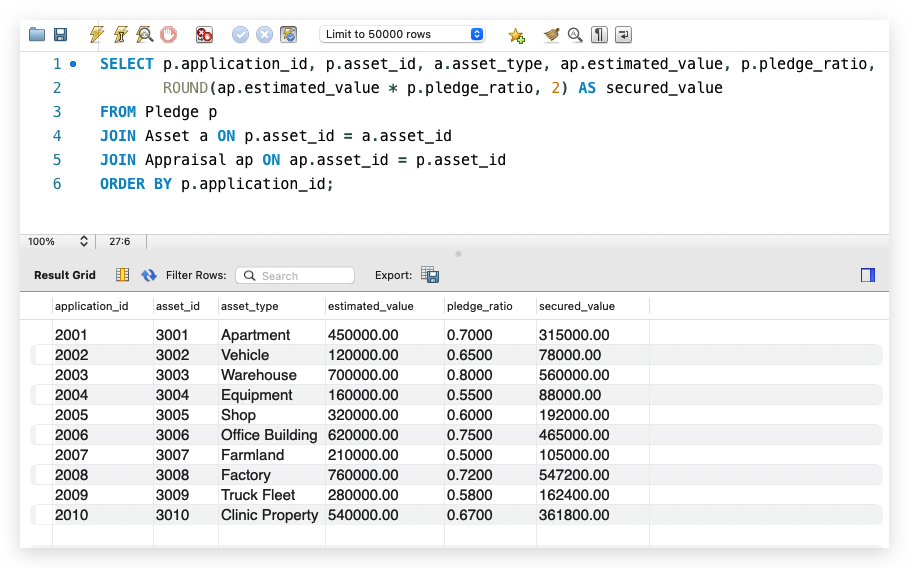

### 查询 4：查看审批状态为 approved 的申请及审批金额

```sql
SELECT la.application_id, c.name AS customer_name, lap.approval_round, lap.approved_amount, lap.result
FROM Loan_Approval lap
JOIN Loan_Application la ON lap.application_id = la.application_id
JOIN Customer c ON la.customer_id = c.customer_id
WHERE lap.result = 'approved'
ORDER BY la.application_id, lap.approval_round;
```

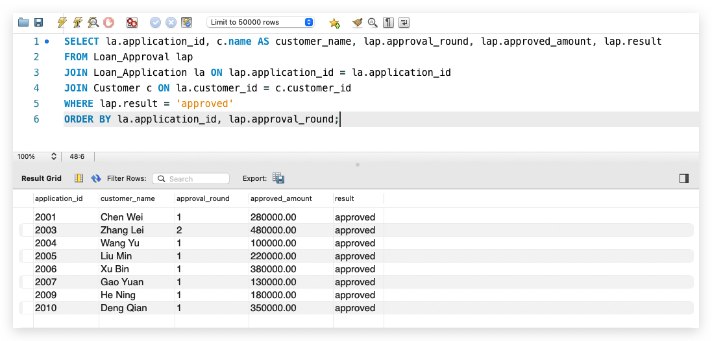

### 查询 5：统计每个贷款申请已还本金、已还利息和还款笔数

```sql
SELECT application_id,
       COUNT(*) AS payment_count,
       SUM(principal_paid) AS total_principal_paid,
       SUM(interest_paid)  AS total_interest_paid
FROM Loan_Payment
GROUP BY application_id
ORDER BY application_id;
```

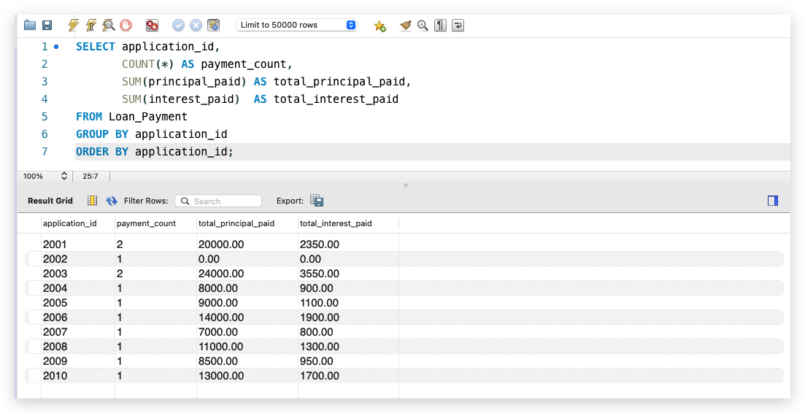

### 查询 6：查询有多于 1 个联系电话的客户

```sql
SELECT cp.customer_id, c.name AS customer_name, COUNT(*) AS phone_count
FROM Customer_Phone cp
JOIN Customer c ON cp.customer_id = c.customer_id
GROUP BY cp.customer_id, c.name
HAVING COUNT(*) > 1
ORDER BY cp.customer_id;
```

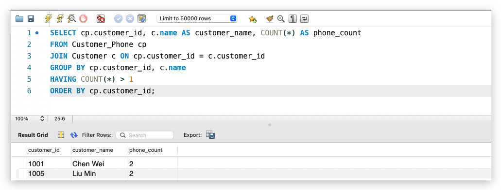

以上查询数量已满足“至少 5 个合理查询”的要求。